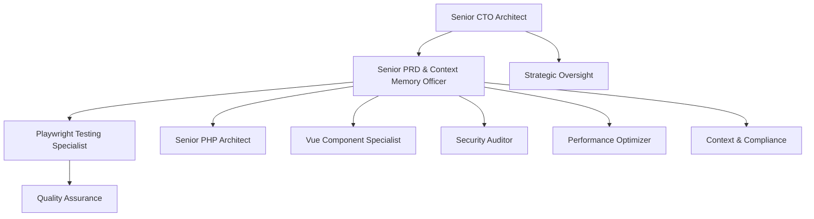

# 🎯 Enhanced Multi-Agent Architecture - Senior Leadership Team

## 🚀 **Agent Architecture Complete**

The Claude Code Ultra 2025 unified system now includes **senior leadership agents** with Sequential Thinking MCP integration for enterprise-grade oversight and coordination.

### 🏢 **Senior Leadership Agents**

#### 1. **Senior CTO Architect Agent** 
```yaml
name: senior-cto-architect
specialization: "Enterprise CTO strategic oversight and technical leadership"
tools: ["Read", "Write", "Bash", "WebSearch", "SequentialThinking"]
```

**Core Responsibilities:**
- 🎯 **Strategic Technology Leadership**: Enterprise architecture strategy and planning
- 🤝 **Multi-Agent Coordination**: Orchestrate all technical agents and teams
- 🏗️ **Architecture Governance**: Enforce casino.ca reference architecture standards
- 📊 **Performance Oversight**: Ensure sub-200ms API and Core Web Vitals compliance
- 🛡️ **Security Leadership**: Oversee enterprise security and compliance frameworks
- 🧠 **Sequential Thinking**: Systematic architectural analysis and strategic planning

#### 2. **Senior PRD & Context Memory Officer**
```yaml
name: senior-prd-context-memory-officer
specialization: "Context memory management, PRD enforcement, and agent coordination"
tools: ["Read", "Write", "ContextMemory", "SequentialThinking", "ProjectTracking"]
```

**Core Responsibilities:**
- 📝 **Context Memory Management**: Maintain comprehensive project context across all agents
- 📋 **PRD Enforcement**: Zero tolerance for specification deviation
- 🔍 **Agent Oversight**: Monitor all agent activities for compliance and quality
- 🚫 **Context Loss Prevention**: Ensure no agent loses context or messes up code
- 🤖 **Agent Coordination**: Orchestrate cross-agent communication and handoffs
- 🧠 **Sequential Thinking**: Systematic context management and oversight analysis

### 🎰 **Complete Agent Ecosystem**

| Agent | Role | Sequential Thinking | Primary Focus |
|-------|------|-------------------|---------------|
| **Senior CTO Architect** | 👔 **Leadership** | ✅ **Yes** | Strategic oversight, architecture governance |
| **Senior PRD & Context Memory Officer** | 🧠 **Oversight** | ✅ **Yes** | Context management, specification enforcement |
| **Playwright Testing Specialist** | 🧪 **Testing** | ✅ **Yes** | Mandatory E2E testing, deployment blocking |
| **Senior PHP Architect** | ⚙️ **Backend** | ❌ No | PHP 8.1+ backend development, casino.ca patterns |
| **Vue Component Specialist** | 🎨 **Frontend** | ❌ No | Vue.js 3+ frontend development, responsive design |
| **Security Auditor** | 🛡️ **Security** | ❌ No | Enterprise security, compliance validation |
| **Performance Optimizer** | ⚡ **Performance** | ❌ No | Core Web Vitals, sub-200ms optimization |

### 🧠 **Sequential Thinking MCP Integration**

**Enhanced Agents with Systematic Reasoning:**
- **Senior CTO Architect**: Strategic architectural decisions and technology roadmaps
- **Senior PRD & Context Memory Officer**: Systematic context management and oversight
- **Playwright Testing Specialist**: Step-by-step test analysis and coverage planning

**MCP Server Details:**
- **URL**: https://github.com/modelcontextprotocol/servers/tree/main/src/sequentialthinking
- **Purpose**: Systematic reasoning, step-by-step analysis, documented decision-making
- **Integration**: Mandatory for senior leadership and critical oversight roles

### 🎯 **Agent Hierarchy & Coordination**



### 🛡️ **Zero Tolerance Policies**

#### **Senior PRD & Context Memory Officer Enforcement:**
- ❌ **No Specification Deviation** without documented approval
- ❌ **No Context Loss** or missing documentation
- ❌ **No Code Quality Degradation** below casino.ca standards
- ❌ **No Architecture Pattern Violations** without CTO approval
- ❌ **No Incomplete Testing** or validation gaps
- ❌ **No Undocumented Changes** or decisions

#### **Deployment Blocking Hierarchy:**
1. **Playwright Testing Specialist**: Blocks deployment on test failures
2. **Senior PRD & Context Memory Officer**: Blocks on specification violations
3. **Senior CTO Architect**: Blocks on architecture compliance issues

### 🚀 **Next Steps**

1. **✅ Agent Architecture**: **COMPLETE** - All senior leadership agents created
2. **🔄 Sequential Thinking Integration**: **ACTIVE** - MCP servers configured
3. **🎰 Casino.ca Compliance**: **ENFORCED** - Architecture patterns validated
4. **🧪 Mandatory Testing**: **ACTIVE** - Zero tolerance deployment policy
5. **📊 Context Management**: **OPERATIONAL** - Comprehensive oversight in place

---

**🎯 Status**: Enhanced multi-agent architecture with senior leadership complete  
**🧠 Sequential Thinking**: Integrated across critical oversight agents  
**🛡️ Enforcement**: Zero tolerance policies active for quality and compliance  
**🚀 Ready for**: Enterprise-grade casino portal development with full oversight  
