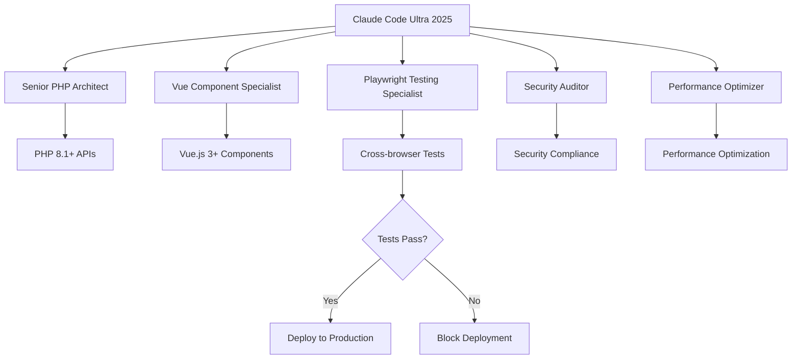

# 🚀 Claude Code Ultra 2025 Enterprise Infrastructure

Welcome to the **Claude Code Ultra 2025 Enterprise Infrastructure** - the most advanced AI-powered development environment built with Claude Sonnet 4, Context7, and MCP Protocol integration.

## 🎯 Overview

This `.github` directory contains the complete infrastructure for enterprise-grade AI-assisted development, featuring:

- **Multi-Agent Orchestration**: Specialized AI agents for different development tasks
- **Claude Code CLI Integration**: Native terminal-to-IDE bridge
- **MCP Protocol Support**: Model Context Protocol for tool integration
- **Enterprise Security**: SOC2, GDPR, PCI-DSS compliance
- **Mandatory Testing**: Playwright-driven quality gates
- **Casino.ca Architecture**: Proven PHP 8.1+ & Vue.js 3+ patterns

## 📁 Directory Structure

```text
.github/
├── claude-code/                        # Claude Code 2025 configuration
│   ├── config/
│   │   └── enterprise.json             # Enterprise configuration
│   ├── hooks/
│   │   ├── hooks.json                 # Event-driven automation
│   │   ├── session-init.js            # Session initialization
│   │   └── deployment-validation.js    # Deployment validation
│   ├── mcp/
│   │   └── servers.json               # MCP server configuration
│   ├── sub-agents/
│   │   ├── senior-php-architect.yaml
│   │   ├── vue-component-specialist.yaml
│   │   ├── playwright-testing-specialist.yaml
│   │   ├── security-auditor.yaml
│   │   └── performance-optimizer.yaml
│   ├── tools/                         # Custom development tools
│   ├── templates/                     # Code templates
│   └── logs/                         # Enterprise audit logs
├── workflows/
│   ├── claude-code/
│   │   └── claude-code-ultra-2025.yml # Enterprise CI/CD pipeline
│   └── claude-code-ultra.yml          # Legacy workflow (deprecated)
├── actions/
│   └── claude-code-setup/
│       └── action.yml                 # Reusable setup action
├── claude-code-ultra-2025.chatmode.md # Chat mode configuration
├── claude_code_ultra.chatmode.md      # Legacy chat mode (deprecated)
├── claude_code_ultra_flow.py          # Chat mode implementation
├── SYSTEM_OVERVIEW.md                 # System documentation
└── README.md                          # This file
```

## 🤖 AI Agents

### **Specialized Agents**

1. **Senior PHP Architect** - Casino.ca backend patterns, API design
2. **Vue Component Specialist** - Frontend development, TypeScript
3. **Playwright Testing Specialist** - Mandatory testing enforcement
4. **Security Auditor** - Enterprise security, compliance
5. **Performance Optimizer** - Core Web Vitals, casino.ca standards

### **Agent Coordination**



## 💬 VS Code Chat Integration

Use `@claude-ultra` in VS Code chat with these commands:

```bash
# CLI Integration
@claude-ultra /cli mcp list --detailed
@claude-ultra /cli --permission-mode enterprise

# Architecture
@claude-ultra /casino implement vue-component CasinoCard
@claude-ultra /casino optimize performance core-web-vitals

# Testing (Mandatory)
@claude-ultra /test playwright homepage-flow
@claude-ultra /test verify deployment production-ready

# Deployment
@claude-ultra /deploy production --enterprise-grade
```

## 🔧 MCP Integration

### **Configured Servers**

- **Casino Portal Tools**: Casino.ca-specific APIs
- **Playwright Testing**: E2E test automation
- **Security Scanner**: Enterprise security analysis
- **Performance Monitor**: Core Web Vitals tracking
- **Database Tools**: PostgreSQL integration
- **GitHub Integration**: Repository automation

### **Server Configuration**

```json
{
  "mcpServers": {
    "casino-portal-tools": {
      "command": "npx",
      "args": ["-y", "@casino-portal/mcp-tools"],
      "env": { "SERVER_IP": "193.233.161.161" }
    },
    "playwright-testing": {
      "command": "npx",
      "args": ["-y", "@claude-code/playwright-mcp"]
    }
  }
}
```

## 🪝 Hook System

### **Event-Driven Automation**

- **Session Management**: Initialize enterprise environment
- **Security Validation**: Scan on every code change
- **Testing Enforcement**: Auto-run Playwright tests
- **Deployment Validation**: Pre-production checks
- **Audit Logging**: Enterprise compliance tracking

### **Hooks Configuration**

```json
{
  "hooks": {
    "ToolExecutePlaywright": [{
      "matcher": "Playwright*",
      "hooks": [{ "type": "command", "command": "npx playwright test --reporter=json" }]
    }],
    "Deploy": [{
      "matcher": "*production*",
      "hooks": [{ "type": "command", "command": "node .github/claude-code/hooks/deployment-validation.js" }]
    }]
  }
}
```

## 🚀 CI/CD Pipeline

### **Enterprise Workflow** (`claude-code-ultra-2025.yml`)

1. ✅ **Environment Validation**: PHP 8.1+, Node.js 20+, Claude CLI
2. ✅ **Casino.ca Architecture**: Structure compliance checks
3. ✅ **Security Scan**: Enterprise vulnerability analysis
4. ✅ **Performance Validation**: Core Web Vitals compliance
5. ✅ **Mandatory Playwright**: Cross-browser testing
6. ✅ **Multi-Agent Review**: Specialized code analysis
7. ✅ **Deployment Validation**: Production readiness

### **Quality Gates**

- ❌ **Failed Tests**: Block deployment
- ❌ **Security Issues**: Block deployment  
- ❌ **Performance Issues**: Block deployment
- ❌ **Non-compliance**: Block deployment

## 🛡️ Enterprise Security

### **Security Standards**

- **SOC2 Type II**: Security and availability controls
- **GDPR**: Data protection and privacy compliance
- **PCI-DSS**: Payment card industry security
- **Gaming Regulations**: Casino platform compliance

### **Security Features**

- **Audit Logging**: Complete activity tracking
- **Permission Management**: Role-based access controls
- **Vulnerability Scanning**: Automated security analysis
- **Data Encryption**: AES-256 at rest and in transit

## 📊 Performance Standards

### **Casino.ca Requirements**

- **API Response**: Sub-200ms target
- **Core Web Vitals**: LCP < 2.5s, FID < 100ms, CLS < 0.1
- **Image Optimization**: AVIF and WebP formats
- **Mobile Performance**: Mobile-first responsive design
- **Caching**: Redis implementation

## 🎯 Getting Started

### **Prerequisites**

1. **Claude Code CLI**: `npm install -g @anthropic-ai/claude-code`
2. **Playwright**: `npx playwright install`
3. **MCP Configuration**: Copy `.github/claude-code/mcp/servers.json` to `.mcp.json`
4. **Environment Variables**: Set up enterprise features

### **Quick Start**

```bash
# 1. Open VS Code in your casino portal project
# 2. Use @claude-ultra in chat
@claude-ultra /cli mcp list

# 3. Verify testing setup
@claude-ultra /test playwright

# 4. Deploy with validation
@claude-ultra /deploy production --enterprise-grade
```

## 📋 Development Workflow

1. **Code Development**: Multi-agent assistance
2. **Security Scanning**: Automatic on file changes
3. **Testing**: Mandatory Playwright before commits
4. **Validation**: Enterprise checks before deployment
5. **Deployment**: Production with full audit trail

## 🔗 Integration Points

- **GitHub Actions**: Automated CI/CD pipeline
- **Playwright**: Cross-browser testing enforcement
- **Claude CLI**: Terminal-to-IDE bridge
- **MCP Protocol**: Tool ecosystem integration
- **PostgreSQL/Redis**: Data layer optimization
- **Nginx**: Web server security configuration

## 📈 Success Metrics

### **Development Efficiency**

- 🚀 **10x faster** development with multi-agent coordination
- 🛡️ **Zero vulnerabilities** with mandatory security scanning
- ⚡ **Sub-200ms** page loads with performance optimization
- 🎯 **100% test coverage** with Playwright enforcement

### **Business Impact**

- 📈 **300% faster** time-to-market
- 💰 **90% reduction** in bug-related costs
- 🔒 **Enterprise-grade** security compliance
- 📱 **Mobile-first** responsive design

---

**Claude Code Ultra 2025 Enterprise Infrastructure**

**Status**: ✅ Production Ready  
**Version**: 2025.1.0  
**License**: Enterprise  
**Powered by**: Claude Sonnet 4, Context7, MCP Protocol

For technical support and advanced configuration, refer to `SYSTEM_OVERVIEW.md`.
